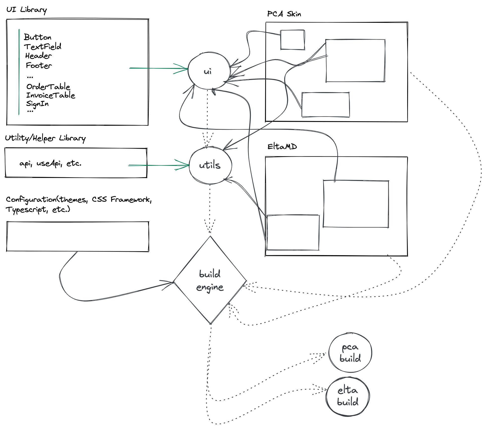
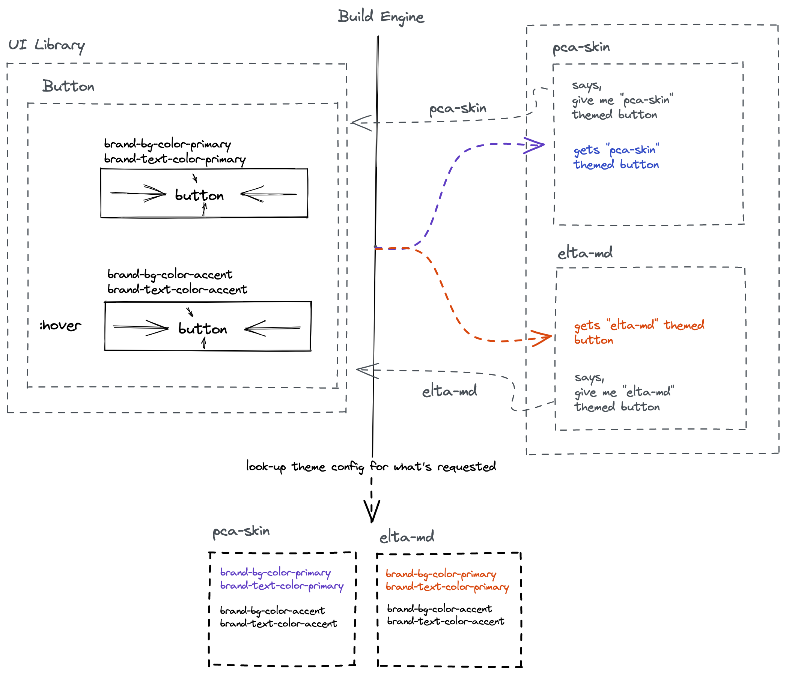

## Brief
**Build an architecture that can support a line of apps that are homogeneous and characteristically similar** with a bit of freedom on
- **Themes** - A slight degree of control over the theme is required so that each app can inherit a brand personality. Applications will have the same layout, and similar controls(button, input fields, header, footer, etc. ) but can have the brand color + fonts applied to the controls like buttons, and some of the typographic elements like heading, links, etc.
- **Data** - All the apps are characteristically similar which means, they're all order/invoice tracking apps and will use a similar layout for controls like tables i.e. `OrderTable` in `app-x`, will behave the same as `OrderTable` in `app-y`, and similar apps `app-*`. What each App can control is the data. Each App will identify itself by a brand key/code/name that when provided to the APIs to fetch orders and invoices returns exactly the data while following the data contract for the table
- **Authentication** - Applications can control how they want to register/login their user. Earlier, auth was expected to behave the same in all the apps, but in later stages it was brought to our notice that PCA skin will employ SSO for user sign in.
- **Deployment** - Applications can control where they're deployed, and how they're deployed. Applications shouldn't be necessarily expected to be available on the sub-domain or the same server. They could be on different servers having independent domain naming schemes and must require/produce just one build with everything pre-packaged/branded.

The primary architectural demands considering the above requirements are
- **Maximum Re-usability** - So that we're DRY(not repeating ourselves) i.e. `OrderTable` done once for `app-x`, shouldn't require a ground-up development/re-work for `app-y`. _This requires a mechanism to keep common-code together that's easily re-usable across various apps. `packages` contain common code and configuration, whereas `apps` levarage the common code and just maintain their unique/non-common logic_
</img>

    Left: **Packages**, Right: **Apps**

- __Theme-ability__ - Controls and typographic elements should allow for a degree of theme-ability, so that `app-x`'s `Button` can have different colors for inactive, hover, and active states than `app-y`'s button, `app-x`'s heading color can be different than `app-y`'s heading color. Comparing and considering the currently available designs for `PCA SkinHealth` and `EltaMD`, and our expectations from the architecture these were the only variables. _`Button` in `app-x` cannot be slightly wider than the Button in `app-y`, heading in `app-x` cannot be slightly smaller than the heading in `app-y`, for branding consistency and give a feeling that they're coming from one place. Applications can still control the font they use_. **Theme-ability** - requires common code but variable independence. Components control their layout but not colors, they rely on a well-defined and controlled/managed system to adapt themselves as per a brand. For example, a button doesn't tell it is _blue_ when inactive and _black_ when hovered, but tells that uses a brand's primary color when inactive and accent color when hovered.

- **Freedom of choosing Authentication/Routing approach and Deployment(probably components too)** - Apps can decide their independent authentication approaches, choose where/how to render pages(routing), and do whatever they want with the final build. The final build (`/build`) produced has everything branded, and packaged into JS, CSS, HTML, and other assets which can easily be ported to different static file servers. As the Apps can choose their auth approaches, routing system, fonts, or probably even choose if one app needs both OrderTable and InvoiceTable or just one of them, they need to own the code that's unique to them.

A mono-repo and compile-time branding make for a natural/optimal choice for the aforementioned needs

**Maximum Re-usability** and **Theme-ability** is promoted by `/packages/*` whereas app-specific code is inside `/apps/*`.

**Apps pull/prepare everything they need at the compile time.**
